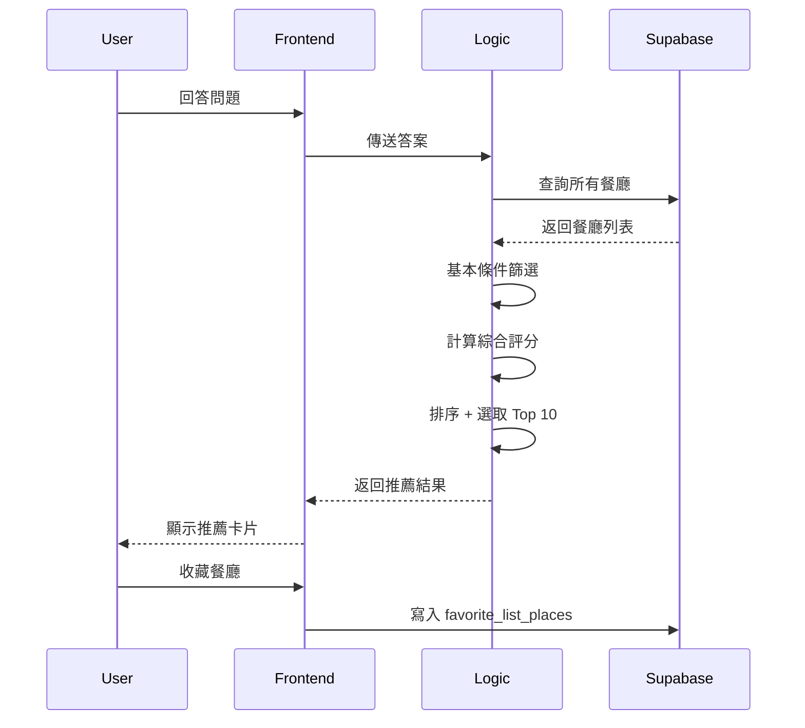
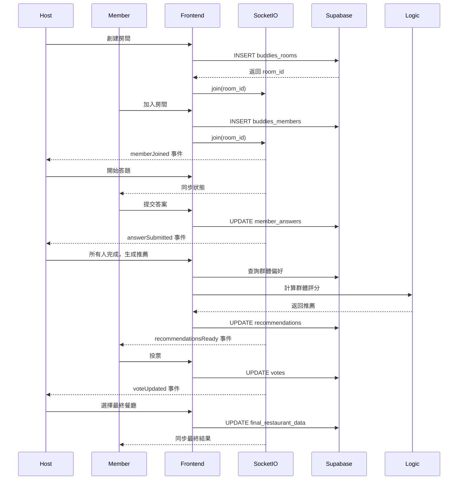
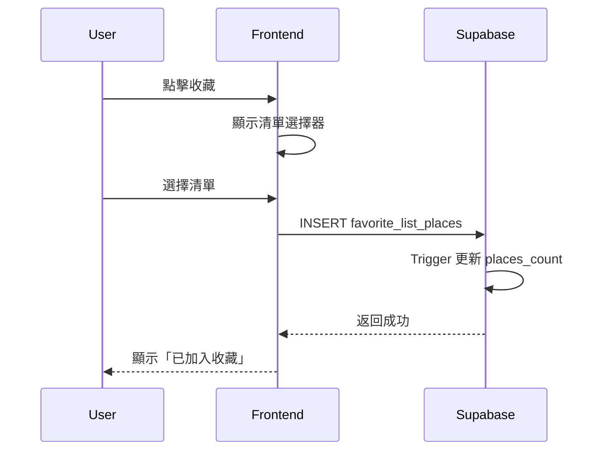

# 🍴 SwiftTaste 系統功能與架構完整說明

**文件版本**：2.0
**最後更新**：2025-10-31
**文件狀態**：正式版本
**文件類型**：系統功能規格書 + 架構設計文件

---

## 📋 目錄

1. [系統概述](#1-系統概述)
2. [核心功能詳細說明](#2-核心功能詳細說明)
3. [使用者介面 (UI/UX)](#3-使用者介面-uiux)
4. [系統架構](#4-系統架構)
5. [資料流程](#5-資料流程)
6. [技術規格](#6-技術規格)
7. [安全性與權限](#7-安全性與權限)
8. [擴展性設計](#8-擴展性設計)

---

## 1. 系統概述

### 1.1 產品定位

SwiftTaste 是一個**智能餐廳推薦平台**，結合以下三大核心價值：

1. **個人化推薦引擎** - 透過問答式互動快速理解使用者偏好
2. **群體決策系統** - 即時協作解決多人聚餐的選擇困難
3. **地理空間探索** - 視覺化呈現周邊餐廳資訊

### 1.2 核心問題與解決方案

| 使用者痛點 | SwiftTaste 解決方案 |
|-----------|-------------------|
| 搜尋結果過多，難以篩選 | 基於偏好的嚴格篩選演算法 |
| 多人聚餐難達成共識 | Buddies 群組投票系統 |
| 不知如何描述需求 | 結構化問答引導 + 趣味問題 |
| 餐廳資訊分散 | 整合 Google + 自有評論系統 |
| 收藏管理混亂 | 多清單系統 + 顏色標記 |

### 1.3 使用者角色

1. **一般使用者** - 搜尋餐廳、收藏、評論
2. **房主 (Host)** - 創建 Buddies 房間、2 倍投票權
3. **房間成員 (Member)** - 參與群組決策
4. **管理員 (Admin)** - 管理餐廳資料、使用者、系統設定

---

## 2. 核心功能詳細說明

### 2.1 SwiftTaste 模式（個人化推薦）

#### 2.1.1 功能概述

**目標**：在 30 秒內為單一使用者產生 3-10 間精準推薦餐廳

**核心機制**：
- 兩階段問答設計（基本問題 + 趣味問題）
- 嚴格篩選機制（不符合條件直接排除）
- 多維度加權評分系統

#### 2.1.2 問答流程

**階段 1：基本問題（必答，4-6 題）**

| 問題 | 選項 | 對應資料庫欄位 |
|-----|------|--------------|
| 人數 | 單人 / 多人 | `restaurants.suggested_people` |
| 預算 | 平價美食 / 奢華美食 | `restaurants.price_range` |
| 餐期 | 吃 / 喝 | `restaurants.tags` |
| 辣度 | 辣 / 不辣 / 都可以 | `restaurants.is_spicy` |

**階段 2：趣味問題（選答，0-3 題）**

| 問題 | 選項 | 映射標籤 |
|-----|------|---------|
| 心情 | 輕鬆自在 / 隆重慶祝 / 社交聚會 / 快速方便 / 慢慢享受 | 詳見 `funQuestionTagsMap.js` |
| 分量 | 吃飽 / 吃一點 | `["吃飽", "吃到飽"]` / `["吃一點", "輕食"]` |
| 風味 | 濃郁風味 / 清爽健康 | `["重口味", "川菜"]` / `["輕食", "沙拉"]` |

#### 2.1.3 評分機制

**綜合評分公式**：

```javascript
總分 = 基本匹配分數 + 趣味問題分數 + 評分分數 + 熱門度分數 + 距離分數
```

**權重分配**：

| 評分維度 | 權重 | 計算方式 |
|---------|------|---------|
| 基本條件匹配 | 10 | 每符合 1 個基本條件 +10 分 |
| 趣味問題匹配 | 5 | 每匹配 1 個標籤 +5 分 |
| 熱門度 | 2 | `min(評論數/100, 1) × 2` |
| 距離 | 2 | 距離衰減函數 × 2 |
| 評分 | 1.5 | `(綜合評分/5) × 1.5` |

**嚴格篩選規則**：

- 若任一基本條件不符合 → **總分直接歸 0**（不推薦）
- 最低分數閾值 `MIN_SCORE = 1`

#### 2.1.4 推薦結果展示

**顯示內容**：
- 餐廳照片（主圖 + 多張附圖）
- 餐廳名稱 + Google 評分
- 匹配原因（基本條件 + 趣味標籤）
- 距離（公里）+ 地址
- 價格區間（$ / $$ / $$$）
- 營業時間 + 電話
- 操作按鈕：收藏 / 導航 / 查看詳情

**互動功能**：
- 左滑/右滑切換餐廳
- 點擊收藏按鈕 → 加入指定清單
- 點擊導航 → 開啟 Google Maps
- 點擊詳情 → 進入餐廳詳細頁面

#### 2.1.5 歷史記錄

**儲存內容**：
- 問答答案（`swifttaste_history.answers`）
- 推薦結果（`swifttaste_history.recommendations`）
- 時間戳記

**用途**：
- 使用者可查看過往推薦
- 系統學習使用者偏好（未來擴展）

---

### 2.2 Buddies 模式（群組決策）

#### 2.2.1 功能概述

**目標**：協助 2-10 人群組在 5 分鐘內達成餐廳共識

**核心機制**：
- 即時多人協作（基於 Socket.IO）
- 房主權重機制（2 倍投票權）
- 群體共識演算法

#### 2.2.2 房間生命週期

```
1. 創建階段
   ├─ 房主創建房間 → 系統生成房間碼 (6 位英數字) + QR Code
   └─ 成員掃碼或輸入房間碼加入

2. 等待階段
   ├─ 顯示當前成員列表（即時更新）
   ├─ 房主可隨時開始答題
   └─ 成員可隨時離開

3. 答題階段
   ├─ 所有成員同時回答相同問題
   ├─ 答題進度即時同步（顯示已完成人數）
   └─ 最後完成者觸發推薦生成

4. 推薦階段
   ├─ 系統根據群體偏好生成推薦清單
   ├─ 成員滑動瀏覽餐廳卡片
   └─ 成員對餐廳進行投票（贊成/反對/棄權）

5. 投票階段
   ├─ 即時顯示投票統計（票數 + 投票者名單）
   ├─ 房主可隨時結束投票
   └─ 系統統計票數並排序

6. 結果階段
   ├─ 顯示最終選定餐廳
   ├─ 提供導航 / 電話 / 地址等功能
   └─ 房主可結束房間
```

#### 2.2.3 問答系統

**問題來源**：
- 與 SwiftTaste 模式共用問題池
- 基本問題（必答）+ 趣味問題（選答）

**答題機制**：
- 每位成員獨立答題
- 答案儲存在 `buddies_rooms.member_answers` (JSONB)
- 答題狀態即時同步

**資料結構**：

```json
{
  "member_answers": {
    "user_id_1": {
      "answers": ["單人", "平價美食", "吃", "不辣"],
      "completed": true,
      "submitted_at": "2025-10-31T10:00:00Z"
    },
    "user_id_2": {
      "answers": ["多人", "奢華美食"],
      "completed": false,
      "submitted_at": "2025-10-31T10:01:00Z"
    }
  }
}
```

#### 2.2.4 群體推薦演算法

**評分公式**：

```javascript
群體總分 =
  群體基本匹配分數 +
  群體趣味偏好分數 +
  共識加成分數 +
  評分分數 +
  熱門度分數 +
  距離分數
```

**權重計算**：

```javascript
// 房主答案權重為 2，其他成員為 1
成員權重 = (userId === hostId) ? 2 : 1

// 群體基本分數
群體基本分數 = Σ (成員權重 × 該成員的基本匹配數) × 10

// 共識加成
共識度 = (贊成票權重 - 反對票權重) / 總權重
共識分數 = 共識度 × 3
```

**範例計算**：

```
房間成員：
- Alice (房主, 權重=2): 答案 ["單人", "平價美食"]
- Bob (成員, 權重=1): 答案 ["單人", "奢華美食"]
- Carol (成員, 權重=1): 答案 ["多人", "平價美食"]

對於餐廳 R (suggested_people="1~", price_range=1):
- Alice: 匹配 2 個 → 2 × 2 = 4
- Bob: 匹配 1 個 (僅"單人") → 1 × 1 = 1
- Carol: 匹配 2 個 → 1 × 2 = 2

群體基本分數 = (4 + 1 + 2) × 10 = 70 分
```

#### 2.2.5 投票系統

**投票選項**：
- ✅ **贊成** - 願意去這間餐廳
- ❌ **反對** - 不想去
- ⏸️ **棄權** - 無所謂

**投票規則**：
- 每間餐廳每位成員僅能投 1 次
- 可隨時修改投票（覆蓋前次投票）
- 房主投票權重為 2

**資料結構**：

```json
{
  "votes": {
    "restaurant_id_1": {
      "count": 3,
      "voters": ["user_id_1", "user_id_2", "user_id_3"]
    },
    "restaurant_id_2": {
      "count": 1,
      "voters": ["user_id_1"]
    }
  }
}
```

#### 2.2.6 最終結果

**選擇邏輯**：
- 房主手動選擇票數最高的餐廳
- 或由房主從投票結果中挑選

**儲存內容**：
```json
{
  "final_restaurant_id": "rest_001",
  "final_restaurant_data": {
    "id": "rest_001",
    "name": "鼎泰豐",
    "address": "台北市信義區信義路五段...",
    "phone": "02-1234-5678",
    // ... 完整餐廳資料
  }
}
```

#### 2.2.7 即時同步機制

**Socket.IO 事件**：

| 事件名稱 | 觸發時機 | 資料內容 |
|---------|---------|---------|
| `memberJoined` | 新成員加入 | `{ roomId, userId, userName }` |
| `memberLeft` | 成員離開 | `{ roomId, userId }` |
| `answerSubmitted` | 成員提交答案 | `{ roomId, userId, progress }` |
| `recommendationsReady` | 推薦生成完成 | `{ roomId, recommendations }` |
| `voteUpdated` | 投票更新 | `{ roomId, restaurantId, voteCount }` |
| `roomClosed` | 房間關閉 | `{ roomId }` |

---

### 2.3 Map 模式（地圖探索）

#### 2.3.1 功能概述

**目標**：提供視覺化的餐廳探索與收藏管理介面

**核心功能**：
- Google Maps 整合
- 餐廳標記與資訊視窗
- 收藏清單管理（多清單 + 顏色標記）
- 餐廳評論與評分

#### 2.3.2 地圖功能

**地圖初始化**：
```javascript
初始中心點：台北 101 (25.0330, 121.5654)
初始縮放級別：14
地圖樣式：標準 Google Maps
```

**餐廳標記 (Markers)**：
- 預設標記：灰色圖釘
- 收藏標記：愛心圖示（根據清單顏色）
- 點擊標記 → 顯示 InfoWindow

**InfoWindow 內容**：
```
┌─────────────────────────┐
│ 📷 餐廳照片              │
│ 🏪 餐廳名稱              │
│ ⭐ 4.5★ (123 則評論)    │
│ 💰 $$ 中價位             │
│ 📍 距離 0.8km            │
│ ➕ 加入收藏              │
│ 🧭 開啟導航              │
└─────────────────────────┘
```

**互動功能**：
- 拖曳地圖 → 更新可見區域餐廳
- 縮放 → 調整顯示密度
- 點擊標記 → 顯示詳情
- 點擊「加入收藏」→ 選擇清單

#### 2.3.3 收藏清單系統

**清單限制**：
- 預設清單：「我的最愛」（紅色，不可刪除）
- 自訂清單：最多 5 個
- 總計：最多 6 個清單

**清單顏色**：

| 顏色名稱 | HEX 值 | 用途 |
|---------|--------|------|
| 紅色 | `#EF4444` | 預設「我的最愛」 |
| 青綠色 | `#14B8A6` | 自訂清單選項 |
| 藍色 | `#3B82F6` | 自訂清單選項 |
| 紫色 | `#A855F7` | 自訂清單選項 |
| 琥珀色 | `#F59E0B` | 自訂清單選項 |
| 粉紅色 | `#EC4899` | 自訂清單選項 |
| 青色 | `#06B6D4` | 自訂清單選項 |
| 亮紫色 | `#8B5CF6` | 自訂清單選項 |
| 橙色 | `#F97316` | 自訂清單選項 |

**智能顏色分配**：
```javascript
// 系統自動選擇未使用的顏色
function getNextAvailableColor(existingLists) {
  const usedColors = existingLists.map(list => list.color);
  return availableColors.find(color => !usedColors.includes(color));
}
```

**資料庫結構**：
```sql
-- 收藏清單表
CREATE TABLE user_favorite_lists (
  id UUID PRIMARY KEY,
  user_id UUID REFERENCES users(id),
  name VARCHAR(50),
  color VARCHAR(7),  -- HEX 顏色碼
  places_count INTEGER DEFAULT 0,
  is_default BOOLEAN DEFAULT false,
  created_at TIMESTAMPTZ DEFAULT NOW()
);

-- 清單內餐廳
CREATE TABLE favorite_list_places (
  id UUID PRIMARY KEY,
  list_id UUID REFERENCES user_favorite_lists(id),
  restaurant_id TEXT REFERENCES restaurants(id),
  notes TEXT,
  added_at TIMESTAMPTZ DEFAULT NOW()
);
```

#### 2.3.4 餐廳詳細頁面

**顯示內容**：

1. **基本資訊**
   - 餐廳名稱
   - 地址 + 地圖位置
   - 電話
   - 營業時間
   - 價格區間
   - 標籤

2. **評分與評論**
   - Google 評分 + 評論數
   - TasteBuddies 評分 + 評論數
   - 綜合評分（加權平均）
   - 評論列表（最新 5 則）

3. **照片集**
   - 主圖 + 多張附圖
   - 點擊放大瀏覽

4. **操作按鈕**
   - 加入收藏
   - 撰寫評論
   - 開啟導航
   - 撥打電話

#### 2.3.5 評論系統

**評論功能**：
- 5 星評分（必填）
- 文字評論（選填，最多 500 字）
- 照片上傳（選填，最多 5 張）

**資料庫結構**：
```sql
CREATE TABLE restaurant_reviews (
  id UUID PRIMARY KEY,
  restaurant_id TEXT REFERENCES restaurants(id),
  user_id UUID REFERENCES users(id),
  rating INTEGER CHECK (rating >= 1 AND rating <= 5),
  comment TEXT,
  images TEXT[],  -- 圖片 URL 陣列
  created_at TIMESTAMPTZ DEFAULT NOW()
);
```

**顯示規則**：
- 預設顯示最新 5 則評論
- 點擊「查看更多」載入更多
- 使用者可編輯/刪除自己的評論

---

### 2.4 用戶系統

#### 2.4.1 認證機制

**支援方式**：
1. Email + 密碼
2. Google OAuth（開發中）

**註冊流程**：
```
輸入 Email + 密碼 →
Email 驗證（Supabase Auth） →
建立使用者檔案 →
自動登入
```

**登入流程**：
```
輸入 Email + 密碼 →
Supabase Auth 驗證 →
取得 Session Token →
自動導向主頁
```

**密碼要求**：
- 最少 8 個字元
- 至少包含 1 個數字
- 至少包含 1 個英文字母

#### 2.4.2 使用者檔案

**可編輯欄位**：
- 頭像（上傳圖片到 Supabase Storage）
- 顯示名稱
- 簡介（最多 200 字）
- 生日
- 性別
- 所在地

**資料庫結構**：
```sql
CREATE TABLE user_profiles (
  id UUID PRIMARY KEY REFERENCES auth.users(id),
  display_name VARCHAR(50),
  avatar_url TEXT,
  bio TEXT,
  birthday DATE,
  gender VARCHAR(10),
  location VARCHAR(100),
  created_at TIMESTAMPTZ DEFAULT NOW(),
  updated_at TIMESTAMPTZ DEFAULT NOW()
);
```

#### 2.4.3 使用者儀表板

**顯示內容**：

1. **統計資訊**
   - 收藏餐廳數量
   - 評論數量
   - 參與 Buddies 次數
   - 使用 SwiftTaste 次數

2. **最近活動**
   - 最近收藏（最新 5 筆）
   - 最近評論（最新 5 筆）
   - 最近 SwiftTaste 記錄（最新 5 筆）

3. **收藏清單管理**
   - 顯示所有清單
   - 建立/編輯/刪除清單
   - 查看清單內餐廳

---

### 2.5 管理員功能

#### 2.5.1 餐廳管理

**功能列表**：
- 新增餐廳（手動輸入 + Google Places API）
- 編輯餐廳資訊
- 刪除餐廳
- 批次匯入餐廳

**餐廳資料欄位**：
```javascript
{
  id: String,                    // 唯一識別碼
  name: String,                  // 餐廳名稱
  address: String,               // 地址
  latitude: Number,              // 緯度
  longitude: Number,             // 經度
  phone: String,                 // 電話
  suggested_people: "1"|"~"|"1~",// 建議人數
  price_range: 1|2|3,            // 價格區間
  tags: String[],                // 標籤陣列
  is_spicy: 'true'|'false'|'both', // 辣度
  rating: Number,                // Google 評分
  user_ratings_total: Number,    // Google 評論數
  opening_hours: Object,         // 營業時間
  photos: String[],              // 照片 URL
  created_at: Timestamp,
  updated_at: Timestamp
}
```

#### 2.5.2 使用者管理

**功能列表**：
- 查看使用者列表
- 封鎖/解封使用者
- 刪除使用者
- 查看使用者活動記錄

#### 2.5.3 系統監控

**監控指標**：
- 每日活躍使用者 (DAU)
- 每週活躍使用者 (WAU)
- 推薦請求數（SwiftTaste + Buddies）
- 收藏數
- 評論數
- 錯誤日誌

---

## 3. 使用者介面 (UI/UX)

### 3.1 設計原則

1. **Mobile-First**：優先針對手機螢幕優化
2. **簡潔直觀**：減少認知負擔，3 步內完成核心操作
3. **即時回饋**：操作後立即顯示結果
4. **一致性**：統一的顏色、字體、間距系統

### 3.2 顏色系統

詳見 [COLOR-GUIDE.md](./COLOR-GUIDE.md)

**主色調**：
- 主色：`#E60012` (SwiftTaste 紅)
- 輔助色：`#FF6B6B` (淺紅)
- 背景色：`#FFFFFF` (白) / `#F8F9FA` (淺灰)
- 文字色：`#1A1A1A` (深灰)

**功能色**：
- 成功：`#10B981` (綠)
- 警告：`#F59E0B` (琥珀)
- 錯誤：`#EF4444` (紅)
- 資訊：`#3B82F6` (藍)

### 3.3 排版系統

**字體**：
- 中文：Noto Sans TC
- 英文/數字：Inter

**字級階層**：
- H1：32px / 2rem (頁面標題)
- H2：24px / 1.5rem (區塊標題)
- H3：20px / 1.25rem (小標題)
- Body：16px / 1rem (內文)
- Caption：14px / 0.875rem (輔助文字)
- Small：12px / 0.75rem (註解)

### 3.4 間距系統

**基準單位**：4px

```css
/* Tailwind-like spacing */
--space-1: 4px;
--space-2: 8px;
--space-3: 12px;
--space-4: 16px;
--space-5: 20px;
--space-6: 24px;
--space-8: 32px;
--space-10: 40px;
--space-12: 48px;
--space-16: 64px;
```

### 3.5 互動設計

**按鈕**：
- 主要按鈕：紅色背景 + 白色文字
- 次要按鈕：白色背景 + 紅色邊框
- 文字按鈕：無邊框，紅色文字
- 圓角：8px
- 高度：48px (適合觸控)

**卡片**：
- 圓角：12px
- 陰影：`0 2px 8px rgba(0,0,0,0.1)`
- 內距：16px

**表單**：
- 輸入框高度：48px
- 圓角：8px
- 邊框：1px solid #E5E7EB
- Focus 狀態：紅色邊框

### 3.6 動畫效果

**轉場動畫**（Framer Motion）：
- 頁面切換：淡入淡出 (300ms)
- 卡片滑動：彈性動畫 (spring)
- 按鈕點擊：縮放效果 (scale 0.95)

**載入動畫**：
- 骨架屏 (Skeleton)
- 旋轉 Spinner
- 進度條

### 3.7 響應式設計

**斷點**：
```css
/* Mobile First */
@media (min-width: 640px) { /* sm: 手機橫向 */ }
@media (min-width: 768px) { /* md: 平板直向 */ }
@media (min-width: 1024px) { /* lg: 平板橫向 */ }
@media (min-width: 1280px) { /* xl: 桌面 */ }
```

**佈局策略**：
- 手機：單欄佈局，垂直滾動
- 平板：雙欄佈局（側邊欄 + 主內容）
- 桌面：三欄佈局（側邊欄 + 主內容 + 附加資訊）

---

## 4. 系統架構

### 4.1 整體架構圖

```
┌─────────────────────────────────────────────────────────────┐
│                         用戶端 (Client)                       │
│  ┌──────────────┐  ┌──────────────┐  ┌──────────────┐      │
│  │ React 19     │  │ Framer Motion│  │ Socket.IO    │      │
│  │ + Vite       │  │ + React Icons│  │ Client       │      │
│  └──────────────┘  └──────────────┘  └──────────────┘      │
└─────────────────────────────────────────────────────────────┘
                           ↕ HTTPS / WebSocket
┌─────────────────────────────────────────────────────────────┐
│                    應用層 (Application Layer)                 │
│  ┌──────────────┐  ┌──────────────┐  ┌──────────────┐      │
│  │ Express.js   │  │ Socket.IO    │  │ Business     │      │
│  │ REST API     │  │ Server       │  │ Logic        │      │
│  └──────────────┘  └──────────────┘  └──────────────┘      │
└─────────────────────────────────────────────────────────────┘
                           ↕ SQL / RPC
┌─────────────────────────────────────────────────────────────┐
│                    資料層 (Data Layer)                        │
│  ┌──────────────┐  ┌──────────────┐  ┌──────────────┐      │
│  │ Supabase     │  │ Supabase     │  │ Supabase     │      │
│  │ PostgreSQL   │  │ Auth         │  │ Storage      │      │
│  └──────────────┘  └──────────────┘  └──────────────┘      │
└─────────────────────────────────────────────────────────────┘
                           ↕ API
┌─────────────────────────────────────────────────────────────┐
│                   外部服務 (External Services)                │
│  ┌──────────────┐  ┌──────────────┐                         │
│  │ Google Maps  │  │ Google Places│                         │
│  │ API          │  │ API          │                         │
│  └──────────────┘  └──────────────┘                         │
└─────────────────────────────────────────────────────────────┘
```

### 4.2 前端架構

**分層設計**：

```
src/
├── pages/                    # 頁面組件（路由層）
│   ├── SwiftTastePage.jsx    # SwiftTaste 模式頁面
│   ├── BuddiesPage.jsx       # Buddies 模式頁面
│   ├── MapPage.jsx           # 地圖頁面
│   ├── UserProfilePage.jsx   # 使用者檔案頁面
│   └── AdminDashboard.jsx    # 管理員儀表板
│
├── components/               # 可重用組件（UI 層）
│   ├── SwiftTaste.jsx        # 主推薦組件
│   ├── BuddiesRoom.jsx       # Buddies 房間
│   ├── map/                  # 地圖相關
│   ├── profile/              # 個人檔案
│   └── common/               # 通用組件（按鈕、卡片等）
│
├── services/                 # API 服務層（資料層）
│   ├── supabaseService.js    # Supabase 核心服務
│   ├── authService.js        # 認證服務
│   ├── restaurantService.js  # 餐廳資料服務
│   ├── userDataService.js    # 使用者資料服務
│   └── socketService.js      # Socket.IO 服務
│
├── logic/                    # 業務邏輯層
│   └── enhancedRecommendLogicFrontend.js  # 推薦演算法
│
├── data/                     # 靜態資料
│   └── funQuestionTagsMap.js # 趣味問題標籤映射
│
├── utils/                    # 工具函數
│   ├── distance.js           # 距離計算
│   ├── validators.js         # 驗證函數
│   └── formatters.js         # 格式化函數
│
└── contexts/                 # React Context
    ├── AuthContext.jsx       # 認證上下文
    └── NavigationContext.jsx # 導航上下文
```

### 4.3 後端架構

**分層設計**：

```
server/
├── index.js                  # Express + Socket.IO 入口
├── routes/                   # REST API 路由
│   ├── restaurants.js
│   ├── users.js
│   └── buddies.js
├── logic/                    # 後端業務邏輯
│   └── enhancedRecommendLogicBackend.js
├── data/                     # 後端資料配置
│   └── funQuestionTagsMap.js
└── middleware/               # 中介軟體
    ├── auth.js               # 認證中介
    └── errorHandler.js       # 錯誤處理
```

### 4.4 資料庫架構（三層架構）

詳見 [THREE-TIER-ARCHITECTURE-FINAL.md](./THREE-TIER-ARCHITECTURE-FINAL.md)

**1️⃣ 實時互動層 (Operational Layer)**

目的：支援高頻讀寫的會話數據

技術：JSONB in `buddies_rooms` table

```sql
buddies_rooms (JSONB 架構)
├── questions (JSONB)              -- 問題集
├── member_answers (JSONB)         -- {"user_id": {...}}
├── recommendations (JSONB)        -- [...]
├── votes (JSONB)                  -- {"restaurant_id": {...}}
├── final_restaurant_id (TEXT)
└── final_restaurant_data (JSONB)
```

**2️⃣ 事件記錄層 (Event Layer)**

目的：詳細記錄所有互動行為（審計追蹤）

技術：Relational table `buddies_interactions`

```sql
buddies_interactions (關聯式表)
├── id (UUID)
├── room_id (TEXT)
├── user_id (TEXT)
├── restaurant_id (TEXT)
├── action_type (TEXT)  -- 'view', 'like', 'skip', 'vote'
├── created_at (TIMESTAMPTZ)
└── metadata (JSONB)
```

**3️⃣ 分析倉儲層 (Analytics Layer)**

目的：歷史聚合、行為統計、推薦優化

技術：PostgreSQL Views / Materialized Views

```sql
-- 範例：餐廳統計視圖
CREATE MATERIALIZED VIEW restaurant_stats AS
SELECT
  restaurant_id,
  COUNT(DISTINCT room_id) as recommended_times,
  COUNT(DISTINCT CASE WHEN action_type = 'vote' THEN user_id END) as votes,
  AVG(...) as conversion_rate
FROM buddies_interactions
GROUP BY restaurant_id;
```

---

## 5. 資料流程

### 5.1 SwiftTaste 推薦流程



### 5.2 Buddies 群組決策流程



### 5.3 收藏流程



---

## 6. 技術規格

### 6.1 效能指標

| 指標 | 目標值 | 測量方式 |
|-----|-------|---------|
| 首次內容繪製 (FCP) | < 1.5s | Lighthouse |
| 最大內容繪製 (LCP) | < 2.5s | Lighthouse |
| 推薦生成時間 | < 500ms | 後端日誌 |
| Socket.IO 延遲 | < 100ms | 客戶端測量 |
| 資料庫查詢 | < 50ms | Supabase 監控 |

### 6.2 瀏覽器支援

| 瀏覽器 | 最低版本 |
|--------|---------|
| Chrome | 90+ |
| Firefox | 88+ |
| Safari | 14+ |
| Edge | 90+ |
| iOS Safari | 14+ |
| Chrome Android | 90+ |

### 6.3 API 規格

**REST API 端點**：

```
GET    /api/restaurants          # 取得餐廳列表
GET    /api/restaurants/:id      # 取得單一餐廳
POST   /api/restaurants          # 新增餐廳（管理員）
PUT    /api/restaurants/:id      # 更新餐廳（管理員）
DELETE /api/restaurants/:id      # 刪除餐廳（管理員）

GET    /api/users/profile        # 取得使用者檔案
PUT    /api/users/profile        # 更新使用者檔案
GET    /api/users/favorites      # 取得收藏清單
POST   /api/users/favorites      # 新增收藏
DELETE /api/users/favorites/:id  # 刪除收藏

POST   /api/reviews              # 新增評論
PUT    /api/reviews/:id          # 更新評論
DELETE /api/reviews/:id          # 刪除評論
```

**Socket.IO 事件**：

```javascript
// 客戶端 → 伺服器
socket.emit('joinRoom', { roomId, userId, userName });
socket.emit('leaveRoom', { roomId, userId });
socket.emit('submitAnswer', { roomId, userId, answers });
socket.emit('vote', { roomId, restaurantId, userId, voteType });

// 伺服器 → 客戶端
socket.on('memberJoined', ({ roomId, userId, userName, memberCount }));
socket.on('memberLeft', ({ roomId, userId, memberCount }));
socket.on('answerSubmitted', ({ roomId, userId, completedCount, totalCount }));
socket.on('voteUpdated', ({ roomId, restaurantId, voteCount, voters }));
socket.on('roomClosed', ({ roomId, reason }));
```

---

## 7. 安全性與權限

詳見 [SECURITY.md](./SECURITY.md)

### 7.1 認證機制

- **Supabase Auth** - JWT Token 認證
- **Session 管理** - 自動刷新 Token
- **密碼雜湊** - bcrypt

### 7.2 Row Level Security (RLS)

**範例政策**：

```sql
-- 使用者只能查看/編輯自己的檔案
CREATE POLICY "Users can view own profile"
ON user_profiles
FOR SELECT
USING (auth.uid() = id);

-- 使用者只能刪除自己的評論
CREATE POLICY "Users can delete own reviews"
ON restaurant_reviews
FOR DELETE
USING (auth.uid() = user_id);

-- Buddies 房間成員可查看房間資料
CREATE POLICY "Members can view room"
ON buddies_rooms
FOR SELECT
USING (
  EXISTS (
    SELECT 1 FROM buddies_members
    WHERE room_id = buddies_rooms.id
      AND user_id = auth.uid()
  )
);
```

### 7.3 資料驗證

**前端驗證**：
- Email 格式驗證
- 密碼強度檢查
- 輸入長度限制
- XSS 防護（React 自動轉義）

**後端驗證**：
- SQL Injection 防護（Supabase 參數化查詢）
- CSRF Token
- Rate Limiting

---

## 8. 擴展性設計

### 8.1 水平擴展

**Supabase**：
- 自動擴展 PostgreSQL
- Connection Pooling

**Socket.IO**：
- Redis Adapter 支援多伺服器
- Sticky Session

### 8.2 快取策略

**前端快取**：
- React Query（資料快取）
- LocalStorage（使用者偏好）
- Service Worker（離線支援，未來）

**後端快取**：
- Redis（熱門餐廳資料）
- Materialized Views（統計數據）

### 8.3 未來擴展

**計畫中功能**：
1. AI 個人化推薦（學習使用者偏好）
2. 社交功能（好友系統、分享餐廳）
3. AR 導航（實景導航到餐廳）
4. 多語言支援（英文、日文）
5. 推播通知（Buddies 邀請、優惠通知）
6. 餐廳訂位整合
7. 優惠券系統

---

## 附錄 A：資料庫 Schema 完整定義

詳見 `database/migrations/` 目錄下的 SQL 腳本。

核心表格：
- `restaurants` - 餐廳主表
- `restaurant_images` - 餐廳圖片
- `restaurant_reviews` - 餐廳評論
- `users` - 使用者（Supabase Auth）
- `user_profiles` - 使用者檔案
- `user_favorite_lists` - 收藏清單
- `favorite_list_places` - 清單餐廳
- `swifttaste_history` - SwiftTaste 歷史
- `buddies_rooms` - Buddies 房間
- `buddies_members` - 房間成員
- `buddies_interactions` - 互動記錄（事件層）

---

## 附錄 B：演算法詳細說明

詳見 [ALGORITHM-SPECIFICATION.md](./ALGORITHM-SPECIFICATION.md)

內容包含：
- 推薦演算法數學形式化定義
- 複雜度分析
- 實驗結果與評估
- 優化策略

---

## 附錄 C：UI/UX 設計規範

詳見 [COLOR-GUIDE.md](./COLOR-GUIDE.md)

內容包含：
- 完整顏色系統
- 排版規範
- 元件庫
- 互動規範

---

**文件維護者**：SwiftTaste Development Team
**聯絡方式**：GitHub Issues
**版本歷史**：
- v2.0 (2025-10-31) - 完整重寫，整合三層架構
- v1.0 (2025-10-27) - 初版

---

**相關文件**：
- [README.md](../README.md) - 快速開始指南
- [ALGORITHM-SPECIFICATION.md](./ALGORITHM-SPECIFICATION.md) - 演算法規範
- [THREE-TIER-ARCHITECTURE-FINAL.md](./THREE-TIER-ARCHITECTURE-FINAL.md) - 資料庫架構
- [COLOR-GUIDE.md](./COLOR-GUIDE.md) - 設計系統
- [SECURITY.md](./SECURITY.md) - 安全性政策
- [CLAUDE.md](./CLAUDE.md) - 開發指南
